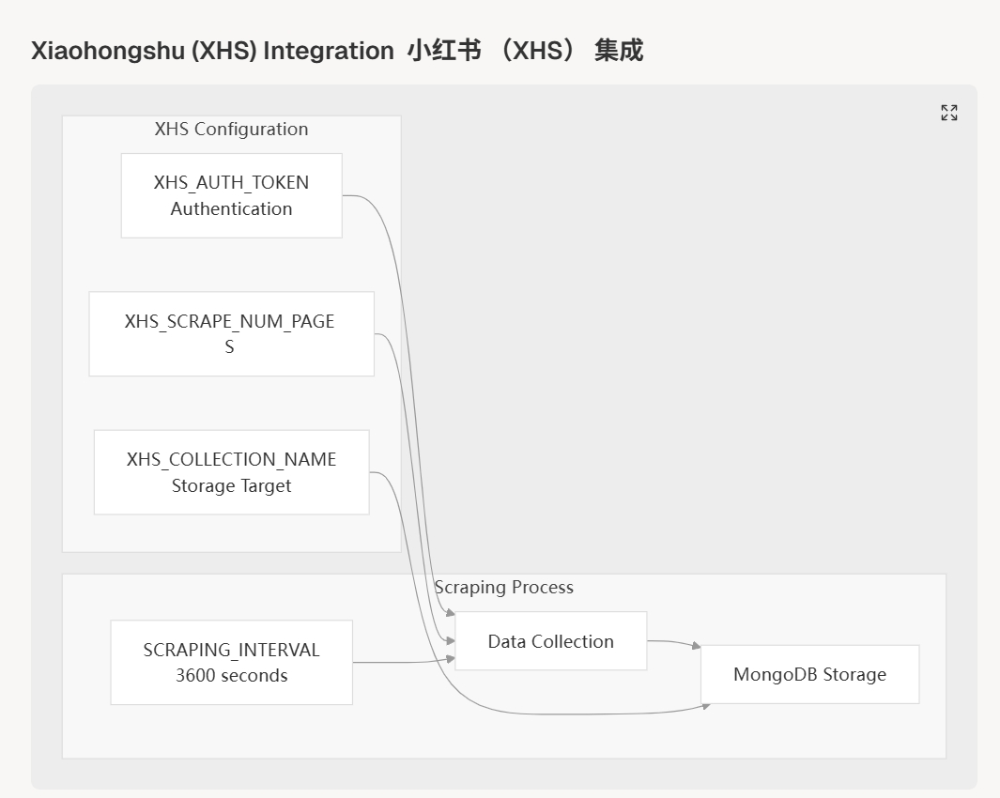

  # AI_data_hub
  
  AI项目适用的数据中心，功能：Ingestion（数据摄取） Transform（数据加工） Explore（探索分析） Retrieve（查询检索）。
  尽可能整合流行有用的数据库和AI数据功能，方便AI数据项目的开发：
  整合各种数据库：mongo_db，postgres_db /Supabase, mysql , Chroma/Milvus, 
  整合langchain,langragh. 
  整合图片多模态/图片搜索 ，ALIYUN_OSS。
  整合RAG和基础agent。
  整合爬虫功能.
  整合FastAPI
  
  
#  安装指南

1. 把data.env-dev 改为 .dev , 配置好参数秘钥：

```
AI Service APIs: OPENAI_API_KEY, OPENAI_MODEL, TAVILY_API_KEY
Database Connections: MONGO_URI, POSTGRES_USERNAME, POSTGRES_PASSWORD
Cloud Storage: ALIYUN_OSS_ACCESS_KEY_ID, ALIYUN_OSS_BUCKET_NAME
Web Scraping: XHS_AUTH_TOKEN, GZH_AUTH_TOKEN, SCRAPING_INTERVAL
```
2. 安装数据库环境：
```
Python conda环境： 
https://zhuanlan.zhihu.com/p/22678445 , 选择Python 3.10
conda active env_310

docker环境：
安装Postgres：
docker run --name my-postgres -e POSTGRES_USER=myuser -e POSTGRES_PASSWORD=mypassword -e POSTGRES_DB=mydatabase -p 5432:5432 -d postgres
安装Mongo：
docker run -d   --name mongodb  -p 27017:27017   mongo
安装Chroma：
conda install chromadb
docker run -d   --name chroma   -p 8000:8000   -v chroma-data:/data   chromadb/chroma
```
2.1 chroma安装成功调试：
```
Python ：
import chromadb
client = chromadb.PersistentClient(path="VECTOR_DB_DIRECTORY")
collection = client.get_collection("VECTOR_DB_COLLECTION")
print(collection.count())
print(collection.get())
```

3. 安装依赖：
```
pip install -r requirements.txt
```
4. 启动服务：
```
python rest_api/main.py

测试服务：

(env_310) D:\AI_data_hub>python -m  rag_graphs.gzh_rag_graph.ingestion  #测试rag

(env_310) D:\AI_data_hub>python -m scraper.xhs_scraper #测试爬虫
``` 


5. 访问：
```
http://localhost:8000
``` 

## ingestion（数据摄取） 
1. 该系统集成了多个用于 AI 处理的外部 API
```
OpenAI 集成 ：通过 OPENAI_BASE_URL https://openai.api2d.net/v1 使用 gpt-4.1-mini 模型
Tavily Search：通过 TAVILY_API_KEY 提供搜索功能
LangSmith Tracing：使用 ENABLE_LANGSMITH 配置的可选监控

```
2. 网页抓取和数据收集
```
小红书 （XHS）：取用tikhub.io第三方数据服务， 通过 XHS_AUTH_TOKEN 进行身份验证，可配置的页面限制 ，采集小红书相关丰富的数据
GZH 平台 ：取用tikhub.io第三方数据服务，通过 GZH_AUTH_TOKEN、可配置的页面限制进行身份验证，采集GZH平台相关丰富的数据
其他各大社交媒体和重要数据可以通过tikhub.io第三方数据服务进行采集
```

2.1. 采集的渠道小红书数据流程：


3. 阿里云 OSS 集成提供了对象存储能力：


 

## Transform（数据加工） 


采集的各渠道数据，从非结构化到结构化，进行数据清洗和转换，以确保数据的准确性和一致性。
例如：python -m  rag_graphs.gzh_rag_graph.ingestion
把文章内容通过向量数据库保存，进一步提供给AI使用RAG功能。


## Explore（探索分析） 

MongoDB 是灵活数据存储的主要文档数据库，包括json结构嵌入和抓取内容。
PostgreSQL 使用定义的架构处理结构化股票市场数据，以实现高效的查询和分析。
向量数据库使用基于目录的存储来嵌入向量和相关元数据，并通过 VECTOR_DB_DIRECTORY 配置进行管理。
阿里云对象存储服务OSS为报告、处理的数据和备份存储提供基于云的文件存储。


## Retrieve（查询检索）

NL2SQL：
```
自然语言查询，并将其转换为针对 PostgreSQL 数据库的可执行 SQL 查询。该系统代表了一个简化的两阶段工作流，专门关注 SQL 的生成和执行，无需额外的结果格式化。
```
Langraph RAG:
Graph System 使用 LangGraph 的 StateGraph 框架实现了简化的 RAG 工作流程。
系统使用 LangGraph 的 StateGraph 框架来编排多步骤工作流，以维护处理节点之间的状态。


Rest_api：
fastapi服务对外提供数据接口访问。


## 使用方法

设置数据处理定时任务：
在 rest_api/main.py：
```
scrape_in_interval(interval: int)
run_scrapers_in_background()
可以自行设置定时任务，
```


## 代码参考：
本项目fork自： https://github.com/vinay-gatech/stocks-insights-ai-agent
进行大量修改，适合国内使用，增加小红书，微信等大型数据平台的抓取。修改成为适合作为AI数据通用中心。可以认为就是一个简化的AI数据中心框架，目前已经整合主流的AI工具，可以根据自己的需求进行扩展。